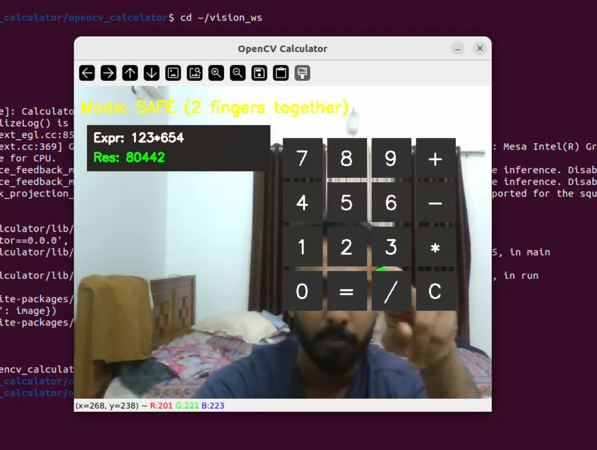

# 👆 OpenCV Gesture Calculator (ROS2 Humble + Mediapipe)

This project is a **touchless gesture-controlled calculator** built using:

- **ROS2 Humble**
- **OpenCV**
- **Mediapipe Hands**
- **Python**
- **Real-time fingertip tracking**
- **Gesture modes (Tap / Safe)**

The calculator UI is drawn using OpenCV and placed over the webcam feed.  
You interact with it *without touching anything*:

### ✋ Gesture Controls
| Gesture | Meaning | Action |
|---------|---------|--------|
| ☝️ One finger (Index only) | TAP Mode | Select & press a button |
| ✌️ Two fingers close together | SAFE Mode | No input allowed |
| Any other gesture | IDLE Mode | No action |

---

# 🚀 Features

### 🔹 Virtual Calculator UI
- Clean 4×4 grid of buttons  
- Fully customizable layout  
- Continuous drawing over webcam feed

### 🔹 Fingertip Tracking (Mediapipe)
- Real-time hand landmark detection  
- Accurate index fingertip extraction  
- Debounced button pressing

### 🔹 Gesture Modes
- **TAP mode** → press buttons  
- **SAFE mode** → prevent accidental touches  
- **IDLE mode** → neutral state

### 🔹 Expression & Result Display
- Shows current math expression  
- Evaluates with `=`  
- Handles invalid input gracefully

---

# 📁 Project Structure

vision_ws/
├── src/
│ └── opencv_calculator/
│ ├── package.xml
│ ├── setup.py
│ ├── opencv_calculator/
│ │ ├── calculator_node.py
│ │ ├── ui_buttons.py
│ └── images/
│ ├── ui_preview.png
│ ├── gesture_tap.png
│ └── gesture_safe.png
├── build/
├── install/
└── log/

This project is licensed under the Apache 2.0 License.

BY : samshoni
